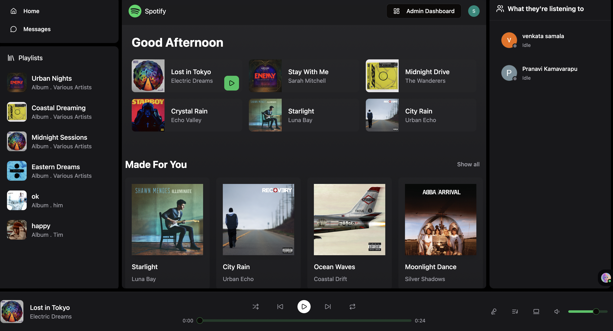
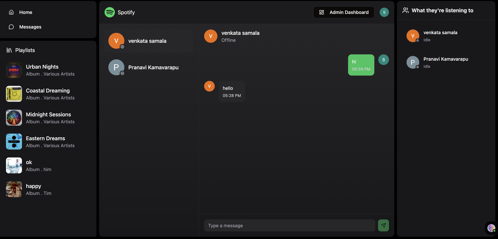
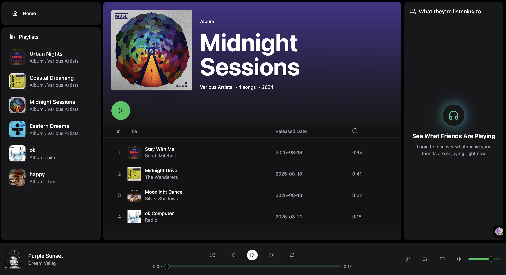
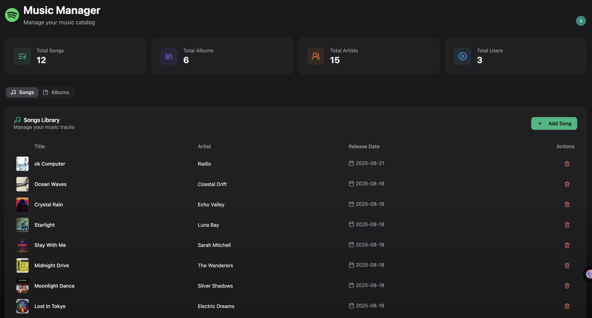
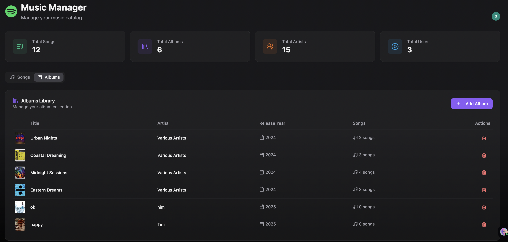
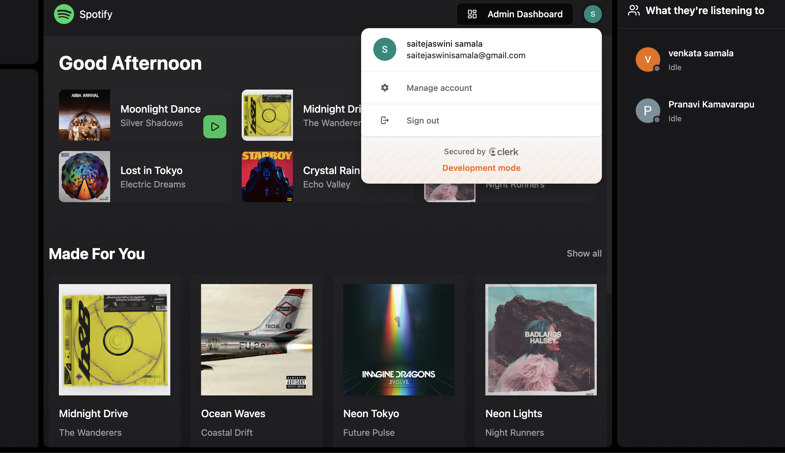

# 🎵 Full-Stack Music Streaming Platform

A full-stack music streaming web application built with **React (TypeScript)** on the frontend and **Express.js (JavaScript)** on the backend. The platform replicates modern music app features while adding role-based access control, real-time chat, and friend activity tracking.

## Live demo: https://chatify-rps0.onrender.com/ 🎉

## 🚀 Features

### Authentication & Access Control

* Secure authentication with **Clerk**.
* **Role-based access**: Admins can manage content, while users stream music and chat.

### Music Management

* Admins can **add/delete songs & albums**.
* Integrated with **Cloudinary** for audio/image uploads.
* Dashboard showing system stats: songs, albums, artists, and users.

### Music Player

* Smooth playback with play, pause, skip, shuffle, and repeat.
* **Queue implementation** to manage upcoming tracks.

### Real-Time Chat & Friend Activity

* **Socket.IO** for instant chat with friends.
* View friend activity: online/offline status and currently playing songs.

### Modern UI

* Responsive design with **React (TypeScript)**, **Tailwind CSS**, and **ShadCN UI**.
* **Zustand** for global state management.
* **Axios instance** for efficient API calls.

---

## 🛠️ Tech Stack

**Frontend (TypeScript):** React, Tailwind CSS, ShadCN UI, Zustand, Axios

**Backend (JavaScript):** Express.js (RESTful APIs), MongoDB, Socket.IO, Cloudinary

**Authentication:** Clerk

**Deployment:** Render

---

## 📂 Project Structure

```bash
.
├── frontend/       # React + TypeScript client
│   ├── components/ # UI components
│   ├── store/      # Zustand global store
│   └── utils/      # Axios instance, helpers
│
├── backend/        # Express server
│   ├── routes/     # API routes (auth, user, songs, albums, admin, stats)
│   ├── models/     # MongoDB schemas
│   ├── controllers/# Business logic
│   └── lib/        # Socket.IO, DB connection
│
└── README.md
```

---

## 📸 Screenshots

### Home & Player



### Messaging



### Album View



### Admin Dashboard – Songs



### Admin Dashboard – Albums



### Clerk Authentication



---

## 🌍 Deployment

* The application is deployed on **Render** for scalable cloud hosting.
* MongoDB Atlas is used as the database.
* Cloudinary handles media storage and delivery.

---

## 👤 Roles

* **Admin**: Manage songs, albums, and view stats.
* **User**: Stream music, manage queues, chat with friends, and view friend activity.

---

## ✨ Future Enhancements

* Playlist creation & sharing.
* Like/Save songs to personal library.
* AI-powered song recommendations.
* Notifications for friend activity.

---


